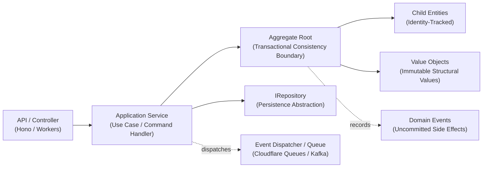

# `domain-objects`

> Foundational Domain-Driven Design (DDD) building blocks for authoring expressive, type-safe, and invariant-protected domain models in TypeScript.

[](https://www.typescriptlang.org/)
[](<>)
[](<>)

---

## Table of Contents

- [Overview & Architectural Motivation](#overview--architectural-motivation)
  - [Rich Domain Models vs. Anemic Data Bags](#rich-domain-models-vs-anemic-data-bags)
  - [Architecture Topology](#architecture-topology)
- [Installation](#installation)
- [Quickstart in 5 Minutes](#quickstart-in-5-minutes)
- [Core DDD Building Blocks Deep Dive](#core-ddd-building-blocks-deep-dive)
  - [`ValueObject<T>` (Structural Immutability)](#valueobjectt-structural-immutability)
  - [`Entity<T>` (Identity & Lifecycle)](#entityt-identity--lifecycle)
  - [`AggregateRoot<T>` (Consistency & Domain Event Hub)](#aggregateroott-consistency--domain-event-hub)
  - [`IDomainEvent` (State Transition Records)](#idomainevent-state-transition-records)
  - [`IRepository<T>` (Persistence Abstraction)](#irepositoryt-persistence-abstraction)
- [Runtime Validation & Invariant Protection](#runtime-validation--invariant-protection)
- [Application Service Orchestration (Command Pattern)](#application-service-orchestration-command-pattern)
- [Infrastructure & Persistence Patterns (Cloudflare D1)](#infrastructure--persistence-patterns-cloudflare-d1)
- [Reactive UI Integration with `@platform/signals`](#reactive-ui-integration-with-platformsignals)
- [API Reference Matrix](#api-reference-matrix)
- [Development & Testing](#development--testing)

---

## Overview & Architectural Motivation

In fast-growing software systems, business logic often scatters across ad-hoc API route handlers, UI components, raw SQL queries, and ORM lifecycle hooks. Data objects degenerate into "anemic" property bags where invariants can be bypassed and inconsistent states become possible.

`domain-objects` provides zero-dependency base classes to enforce tactical Domain-Driven Design (DDD) in modern TypeScript:

- **Encapsulated Invariants**: Business validation and rules live directly inside the domain model, preventing invalid state from ever existing.
- **Explicit Consistency Boundaries**: Aggregate roots isolate transactional boundaries, ensuring multi-entity state mutations remain atomic.
- **Structural Immutability**: Value objects provide deep runtime immutability (`Object.freeze`) and deterministic structural equality comparisons.
- **Decoupled Architecture**: Domain models remain 100% agnostic of transport layers (Hono, HTTP, gRPC) and database engines (Cloudflare D1, SQLite, PostgreSQL).

### Rich Domain Models vs. Anemic Data Bags

| Dimension             | Anemic Data Bag Approach ❌                            | Rich Domain Model Approach (`domain-objects`) ✅        |
| :-------------------- | :----------------------------------------------------- | :------------------------------------------------------ |
| **Logic Placement**   | Procedural services, controllers, or database triggers | Encapsulated within domain entities and value objects   |
| **State Validation**  | Fragmented across endpoints and forms                  | Guaranteed at instantiation and on state transition     |
| **Identity vs Value** | Everything is a plain object or row ID                 | Explicit distinction between `Entity` and `ValueObject` |
| **Side Effects**      | Ad-hoc service calls intertwined with mutations        | Recorded explicitly as `IDomainEvent` instances         |
| **Testability**       | Requires database mocking or complex fixtures          | Pure in-memory unit tests without external I/O          |

### Architecture Topology



---

## Installation

Add `domain-objects` to your workspace project's `package.json`:

```json
{
  "dependencies": {
    "domain-objects": "workspace:*"
  }
}
```

Import the core primitives:

```ts
import {
  Entity,
  AggregateRoot,
  ValueObject,
  IDomainEvent,
  IRepository,
} from "domain-objects";
```

---

## Quickstart in 5 Minutes

Let's model an e-commerce **Order Fulfillment** domain with currency-safe money calculations, item entity tracking, invariant validation, and domain event publishing.

```ts
import {
  AggregateRoot,
  Entity,
  ValueObject,
  IDomainEvent,
  IRepository,
} from "domain-objects";

// 1. Immutable Value Object: Money with currency safety
export interface MoneyProps {
  amount: number;
  currency: string;
}

export class Money extends ValueObject<MoneyProps> {
  get amount(): number {
    return this.props.amount;
  }

  get currency(): string {
    return this.props.currency;
  }

  public add(other: Money): Money {
    if (this.currency !== other.currency) {
      throw new Error(
        `Cannot add currency ${other.currency} to ${this.currency}`,
      );
    }
    return new Money({
      amount: this.amount + other.amount,
      currency: this.currency,
    });
  }
}

// 2. Child Entity: OrderItem tracked by item identity
export interface OrderItemProps {
  name: string;
  unitPrice: Money;
  quantity: number;
}

export class OrderItem extends Entity<OrderItemProps> {
  get total(): Money {
    return new Money({
      amount: this.props.unitPrice.amount * this.props.quantity,
      currency: this.props.unitPrice.currency,
    });
  }
}

// 3. Domain Event: Capture state changes for downstream subscribers
export class OrderPlacedEvent implements IDomainEvent {
  public readonly dateTimeOccurred = new Date();

  constructor(
    public readonly orderId: string,
    public readonly totalAmount: number,
  ) {}

  public getAggregateId(): string {
    return this.orderId;
  }
}

// 4. Aggregate Root: Transactional boundary & invariant enforcement
export interface OrderProps {
  customerId: string;
  items: OrderItem[];
  status: "draft" | "placed" | "paid" | "cancelled";
}

export class Order extends AggregateRoot<OrderProps> {
  public static create(id: string, customerId: string): Order {
    return new Order({ customerId, items: [], status: "draft" }, id);
  }

  public addItem(item: OrderItem): void {
    if (this.props.status !== "draft") {
      throw new Error(
        "Cannot add items to an order that is no longer in draft status",
      );
    }
    this.props.items.push(item);
  }

  public placeOrder(): void {
    if (this.props.items.length === 0) {
      throw new Error("Cannot place an empty order");
    }
    if (this.props.status !== "draft") {
      throw new Error("Order is already placed or cancelled");
    }

    this.props.status = "placed";
    const totalAmount = this.props.items.reduce(
      (sum, item) => sum + item.total.amount,
      0,
    );

    // Record domain event for dispatch after persistence
    this.addDomainEvent(new OrderPlacedEvent(this.id, totalAmount));
  }
}
```

---

## Core DDD Building Blocks Deep Dive

### `ValueObject<T>` (Structural Immutability)

Value Objects describe concepts in your domain that have no persistent identity. They are defined entirely by their attribute values.

- **Deep Runtime Immutability**: The constructor automatically executes `Object.freeze` on `props`.
- **Structural Equality (`equals`)**: Two value objects are identical if their serialized properties match, regardless of object reference.

```ts
import { ValueObject } from "domain-objects";

export interface AddressProps {
  street: string;
  city: string;
  postcode: string;
}

export class Address extends ValueObject<AddressProps> {
  get street(): string {
    return this.props.street;
  }
  get city(): string {
    return this.props.city;
  }
  get postcode(): string {
    return this.props.postcode;
  }
}

const addr1 = new Address({
  street: "123 King St",
  city: "Sydney",
  postcode: "2000",
});
const addr2 = new Address({
  street: "123 King St",
  city: "Sydney",
  postcode: "2000",
});

console.log(addr1.equals(addr2)); // true (structural equality)
console.log(addr1 === addr2); // false (distinct object references)

// Mutating frozen props throws a runtime error
// addr1.props.city = 'Melbourne'; // TypeError: Cannot assign to read only property
```

---

### `Entity<T>` (Identity & Lifecycle)

Entities represent domain concepts defined not by their attributes, but by a unique identity (`_id`) that remains constant across state mutations and lifecycle transitions.

- **Identity-Based Equality (`equals`)**: Two entities are considered equal if their unique `id` matches.
- **Mutable Encapsulated State (`props`)**: Entity attributes can be modified through explicit domain methods.

```ts
import { Entity } from "domain-objects";

export interface CustomerProps {
  name: string;
  email: string;
}

export class Customer extends Entity<CustomerProps> {
  public updateEmail(newEmail: string): void {
    this.props.email = newEmail;
  }
}

const cust1 = new Customer(
  { name: "Alice", email: "alice@example.com" },
  "cust_101",
);
const cust2 = new Customer(
  { name: "Alice Smith", email: "alice.smith@example.com" },
  "cust_101",
);

console.log(cust1.equals(cust2)); // true (same identity 'cust_101')
```

---

### `AggregateRoot<T>` (Consistency & Domain Event Hub)

An Aggregate Root is a specialized `Entity` that acts as the single gateway for a cluster of associated entities and value objects.

- **Invariant Enforcement**: External code cannot modify child entities directly; all mutations go through methods on the Aggregate Root.
- **Domain Event Buffer**: Aggregates record domain events via `this.addDomainEvent(event)`.
- **Event Lifecycle**:
  - `aggregate.domainEvents`: Array of uncommitted domain events.
  - `aggregate.clearEvents()`: Clears the internal event buffer once events are published.

```ts
import { AggregateRoot } from "domain-objects";

export class Order extends AggregateRoot<OrderProps> {
  public markAsPaid(): void {
    if (this.props.status !== "placed") {
      throw new Error("Only placed orders can be marked as paid");
    }
    this.props.status = "paid";
    this.addDomainEvent(new OrderPaidEvent(this.id, new Date()));
  }
}

const order = Order.create("ord_1", "cust_101");
order.addItem(
  new OrderItem(
    {
      name: "Widget",
      unitPrice: new Money({ amount: 50, currency: "USD" }),
      quantity: 2,
    },
    "item_1",
  ),
);
order.placeOrder();

console.log(order.domainEvents.length); // 1 (OrderPlacedEvent recorded)
```

---

### `IDomainEvent` (State Transition Records)

Domain Events represent immutable historical records of significant business occurrences. They facilitate decoupled, asynchronous communication across aggregates and microservices.

Every domain event adheres to the [`IDomainEvent`](./src/event.ts) interface:

```ts
export interface IDomainEvent {
  dateTimeOccurred: Date;
  getAggregateId(): string;
}
```

```ts
export class OrderPaidEvent implements IDomainEvent {
  public readonly dateTimeOccurred: Date;

  constructor(
    public readonly orderId: string,
    public readonly paidAt: Date,
  ) {
    this.dateTimeOccurred = paidAt;
  }

  public getAggregateId(): string {
    return this.orderId;
  }
}
```

---

### `IRepository<T>` (Persistence Abstraction)

The [`IRepository<T>`](./src/repository.ts) interface provides a collection-oriented abstraction for persisting and loading Aggregate Roots. Repositories completely decouple domain entities from database drivers, SQL schemas, or caching layers.

```ts
export interface IRepository<T> {
  save(aggregate: T): Promise<void>;
  findById(id: string): Promise<T | null>;
  findAll(): Promise<T[]>;
  update(aggregate: T): Promise<void>;
  delete(id: string): Promise<void>;
}
```

---

## Runtime Validation & Invariant Protection

Ensure domain objects never enter an invalid state by pairing constructors and static factories with schema validation libraries like **Zod** or **Valibot**:

```ts
import { z } from "zod";
import { ValueObject } from "domain-objects";

const EmailSchema = z.string().email().min(5).max(255);

export class Email extends ValueObject<{ value: string }> {
  constructor(rawInput: string) {
    const validated = EmailSchema.parse(rawInput.trim().toLowerCase());
    super({ value: validated });
  }

  get value(): string {
    return this.props.value;
  }
}

// Valid instantiation:
const email = new Email("  Alice@Example.com ");
console.log(email.value); // 'alice@example.com'

// Invalid instantiation immediately throws a Zod validation error:
// const invalid = new Email('not-an-email'); // ZodError: Invalid email
```

---

## Application Service Orchestration (Command Pattern)

Application Services (or Command Handlers) coordinate the end-to-end lifecycle: loading an aggregate from a repository, invoking domain logic, saving changes, and publishing domain events.

```ts
import { IRepository, IDomainEvent } from "domain-objects";
import { Order } from "./order-aggregate";

export interface PlaceOrderCommand {
  orderId: string;
}

export interface IEventBus {
  publishAll(events: IDomainEvent[]): Promise<void>;
}

export class PlaceOrderService {
  constructor(
    private readonly orderRepository: IRepository<Order>,
    private readonly eventBus: IEventBus,
  ) {}

  public async execute(command: PlaceOrderCommand): Promise<void> {
    // 1. Load aggregate root from repository
    const order = await this.orderRepository.findById(command.orderId);
    if (!order) {
      throw new Error(`Order ${command.orderId} not found`);
    }

    // 2. Execute domain logic (invariants enforced inside the domain model)
    order.placeOrder();

    // 3. Persist updated aggregate state
    await this.orderRepository.update(order);

    // 4. Dispatch uncommitted domain events to the message broker
    await this.eventBus.publishAll(order.domainEvents);

    // 5. Clear dispatched events
    order.clearEvents();
  }
}
```

---

## Infrastructure & Persistence Patterns (Cloudflare D1)

Implement the [`IRepository<T>`](./src/repository.ts) interface using Cloudflare D1 or relational SQLite/Postgres. Map relational columns to and from domain aggregate instances cleanly:

```ts
import { IRepository } from "domain-objects";
import { Order, OrderItem, Money } from "./order-domain";

export class D1OrderRepository implements IRepository<Order> {
  constructor(private readonly db: D1Database) {}

  public async findById(id: string): Promise<Order | null> {
    const row = await this.db
      .prepare(
        "SELECT id, customer_id, items_json, status FROM orders WHERE id = ?",
      )
      .bind(id)
      .first<{
        id: string;
        customer_id: string;
        items_json: string;
        status: string;
      }>();

    if (!row) return null;

    // Hydrate domain entities & value objects from stored representation
    const rawItems = JSON.parse(row.items_json) as Array<{
      id: string;
      name: string;
      amount: number;
      currency: string;
      quantity: number;
    }>;
    const items = rawItems.map(
      (item) =>
        new OrderItem(
          {
            name: item.name,
            unitPrice: new Money({
              amount: item.amount,
              currency: item.currency,
            }),
            quantity: item.quantity,
          },
          item.id,
        ),
    );

    return new Order(
      {
        customerId: row.customer_id,
        items,
        status: row.status as any,
      },
      row.id,
    );
  }

  public async save(order: Order): Promise<void> {
    const itemsJson = JSON.stringify(
      order.props.items.map((i) => ({
        id: i.id,
        name: i.props.name,
        amount: i.props.unitPrice.amount,
        currency: i.props.unitPrice.currency,
        quantity: i.props.quantity,
      })),
    );

    await this.db
      .prepare(
        "INSERT INTO orders (id, customer_id, items_json, status) VALUES (?, ?, ?, ?)",
      )
      .bind(order.id, order.props.customerId, itemsJson, order.props.status)
      .run();
  }

  public async update(order: Order): Promise<void> {
    const itemsJson = JSON.stringify(
      order.props.items.map((i) => ({
        id: i.id,
        name: i.props.name,
        amount: i.props.unitPrice.amount,
        currency: i.props.unitPrice.currency,
        quantity: i.props.quantity,
      })),
    );

    await this.db
      .prepare(
        "UPDATE orders SET customer_id = ?, items_json = ?, status = ? WHERE id = ?",
      )
      .bind(order.props.customerId, itemsJson, order.props.status, order.id)
      .run();
  }

  public async delete(id: string): Promise<void> {
    await this.db.prepare("DELETE FROM orders WHERE id = ?").bind(id).run();
  }

  public async findAll(): Promise<Order[]> {
    const { results } = await this.db
      .prepare("SELECT id FROM orders")
      .all<{ id: string }>();
    const orders: Order[] = [];
    for (const row of results) {
      const order = await this.findById(row.id);
      if (order) orders.push(order);
    }
    return orders;
  }
}
```

---

## Reactive UI Integration with `@platform/signals`

For client-side domain stores and interactive applications, domain objects can be paired with `@platform/signals` for fine-grained, zero-boilerplate UI updates:

```ts
import { makeReactive } from "@platform/signals";
import { Order } from "./order-domain";

export class ReactiveOrderStore {
  public order: Order;

  constructor(order: Order) {
    this.order = order;
    return makeReactive(this); // Automatically triggers reactive UI updates when order state changes
  }
}
```

---

## API Reference Matrix

| Class / Interface      | Type Signature                                      | Key Properties / Methods                                                                                                                                     | Description                                                                                |
| :--------------------- | :-------------------------------------------------- | :----------------------------------------------------------------------------------------------------------------------------------------------------------- | :----------------------------------------------------------------------------------------- |
| **`ValueObject<T>`**   | `abstract class ValueObject<T>`                     | `protected readonly props: T`<br>`equals(other?): boolean`                                                                                                   | Immutable domain concept identified strictly by structural property equality.              |
| **`Entity<T>`**        | `abstract class Entity<T>`                          | `get id(): string`<br>`public props: T`<br>`equals(other?): boolean`                                                                                         | Base domain object identified by a persistent unique ID throughout its lifecycle.          |
| **`AggregateRoot<T>`** | `abstract class AggregateRoot<T> extends Entity<T>` | `get domainEvents: IDomainEvent[]`<br>`protected addDomainEvent(e): void`<br>`public clearEvents(): void`                                                    | Entry-point entity guarding an aggregate consistency boundary and buffering domain events. |
| **`IDomainEvent`**     | `interface IDomainEvent`                            | `dateTimeOccurred: Date`<br>`getAggregateId(): string`                                                                                                       | Contract for immutable records of business state changes.                                  |
| **`IRepository<T>`**   | `interface IRepository<T>`                          | `save(agg): Promise<void>`<br>`findById(id): Promise<T \| null>`<br>`findAll(): Promise<T[]>`<br>`update(agg): Promise<void>`<br>`delete(id): Promise<void>` | Collection-oriented persistence interface decoupling storage from domain aggregates.       |

---

## Development & Testing

```bash
# Install dependencies
pnpm install

# Run unit tests with Vitest
pnpm test

# Build package artifacts with Rslib
pnpm run build

# Format codebase with Prettier
pnpm run format
```
