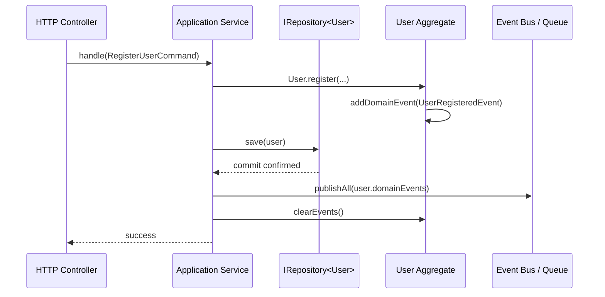

# Domain Events & Dispatching

A **Domain Event** represents an immutable record of something meaningful that occurred in the domain. Domain Events enable decoupled, asynchronous communication across aggregates and external systems.

---

## The `IDomainEvent` Interface

Every domain event in `@banksia/domain-objects` implements the `IDomainEvent` contract:

```ts
export interface IDomainEvent {
  dateTimeOccurred: Date;
  getAggregateId(): string;
}
```

- **`dateTimeOccurred`**: Timestamp recording exactly when the event was instantiated in UTC.
- **`getAggregateId()`**: Method returning the identity of the Aggregate Root that produced the event.

---

## Defining Domain Events

Domain event classes should be strongly typed and immutable. Name events using past-tense business verbs:

```ts
import type { IDomainEvent } from "@banksia/domain-objects";

export class UserRegisteredEvent implements IDomainEvent {
  public readonly dateTimeOccurred = new Date();

  constructor(
    public readonly userId: string,
    public readonly email: string,
    public readonly tenantId: string,
  ) {}

  public getAggregateId(): string {
    return this.userId;
  }
}
```

---

## Recording & Dispatching Patterns

Domain events are recorded inside the Aggregate Root as business actions occur, and dispatched only after changes are successfully persisted to storage:



### Application Service Example

```ts
import type { IRepository, IDomainEvent } from "@banksia/domain-objects";
import { User, UserRegisteredEvent } from "./user-domain";

export interface IEventDispatcher {
  publishAll(events: IDomainEvent[]): Promise<void>;
}

export class RegisterUserService {
  constructor(
    private readonly userRepository: IRepository<User>,
    private readonly dispatcher: IEventDispatcher,
  ) {}

  public async execute(email: string, tenantId: string): Promise<string> {
    const user = User.register(crypto.randomUUID(), email, tenantId);

    // 1. Persist aggregate to database within transactional boundary
    await this.userRepository.save(user);

    // 2. Dispatch recorded domain events to queue or message broker
    await this.dispatcher.publishAll(user.domainEvents);

    // 3. Clear events to prevent duplicate publishing
    user.clearEvents();

    return user.id;
  }
}
```

---

## Messaging & Queue Integration

Because `IDomainEvent` instances are simple, JSON-serializable records with a clear timestamp and aggregate identifier, they integrate naturally with:

- **Cloudflare Queues**: Serverless asynchronous event workers.
- **Kafka / RabbitMQ / AWS SQS**: Asynchronous event choreography across microservices.
- **Transactional Outbox Pattern**: Storing events in an outbox table before broadcasting.
