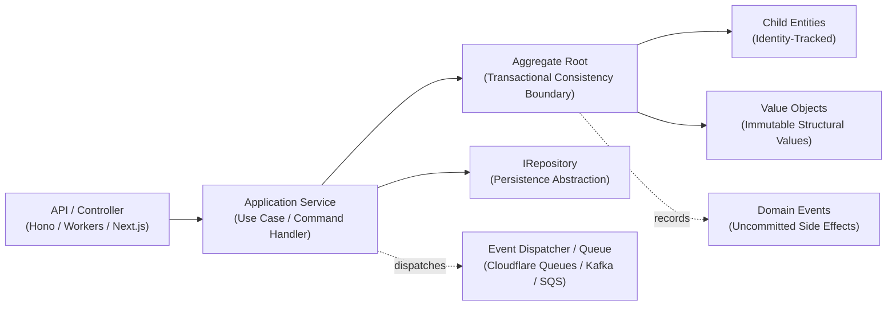

# Introduction & Architecture

`@banksia/domain-objects` provides zero-dependency base classes to author expressive, type-safe, and invariant-protected domain models in TypeScript according to tactical Domain-Driven Design (DDD) principles.

---

## Architectural Motivation

In fast-growing software applications, business logic frequently scatters across HTTP route handlers, API controllers, database migration hooks, and UI components. Data objects degenerate into "anemic" property bags where:

- Invariants are easily bypassed or forgotten.
- Invalid states can be instantiated silently.
- Side effects (such as notifications or secondary workflows) get tightly tangled with database queries.
- Business rules become impossible to test without spinning up mock databases or complete server environments.

`@banksia/domain-objects` provides battle-tested building blocks to encapsulate state and rules directly within the domain model:

- **Encapsulated Invariants**: Rules and business validations live directly within domain classes, guaranteeing that invalid state can never exist.
- **Explicit Consistency Boundaries**: Aggregate Roots isolate transactional units, ensuring that multi-entity state mutations remain atomic.
- **Structural Immutability**: Value Objects ensure deep runtime immutability (`Object.freeze`) and deterministic structural equality comparisons.
- **Decoupled Architecture**: Domain models remain 100% agnostic of transport layers (Hono, Express, Fastify, gRPC) and database engines (Cloudflare D1, SQLite, PostgreSQL, MongoDB).

---

## Rich Domain Models vs. Anemic Data Bags

| Dimension             | Anemic Data Bag Approach ❌                            | Rich Domain Model Approach (`@banksia/domain-objects`) ✅ |
| :-------------------- | :----------------------------------------------------- | :-------------------------------------------------------- |
| **Logic Placement**   | Procedural services, controllers, or database triggers | Encapsulated within domain entities and value objects     |
| **State Validation**  | Fragmented across endpoints and request bodies         | Guaranteed at instantiation and on state transition       |
| **Identity vs Value** | Everything is a plain object or arbitrary row ID       | Explicit distinction between `Entity` and `ValueObject`   |
| **Side Effects**      | Ad-hoc service calls intertwined with mutations        | Recorded explicitly as `IDomainEvent` instances           |
| **Testability**       | Requires database mocking or complex fixtures          | Pure in-memory unit tests without external I/O            |

---

## Architecture Topology

The tactical DDD architecture cleanly decouples domain invariants from presentation, application use cases, and persistence infrastructure:

1. **Transport Layer**: Receives external input (HTTP, WebSocket, RPC) and forwards parsed commands to application services.
2. **Application Service**: Orchestrates use cases by loading aggregate roots via repository interfaces, invoking domain behaviors, and persisting changes.
3. **Aggregate Root**: Enforces domain invariants, coordinates internal child entities and value objects, and records domain events.
4. **Repository**: Abstracts the persistence mechanism, converting between raw database storage and rich domain aggregates.
5. **Event Dispatcher**: Asynchronously publishes buffered domain events after the transaction successfully commits.
