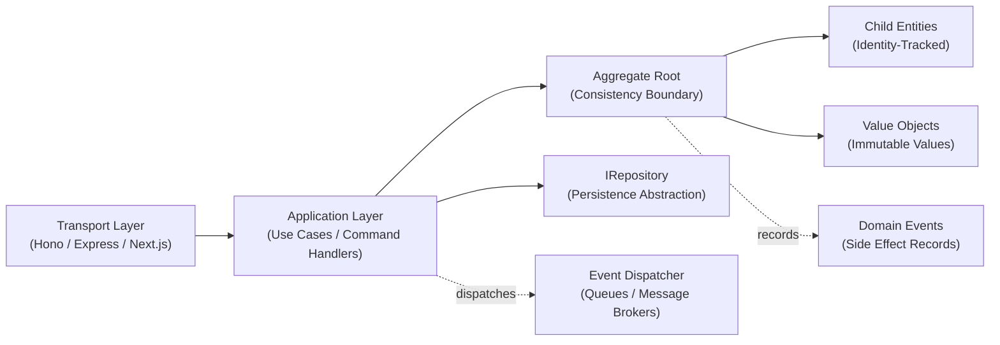

# Introduction & Architecture

`@banksia/domain-objects` is a zero-dependency, ultra-lightweight (~238 B) TypeScript toolkit that provides the foundational building blocks for Domain-Driven Design (DDD).

---

## The Core Building Blocks

- **Values**: Concepts defined purely by their data rather than an identity (e.g., money, addresses, email addresses). Immutable and interchangeable.
- **Entities**: Concepts defined by a persistent, unique identity that endures across state changes and lifecycles (e.g., users, products, accounts).
- **Aggregates**: Clusters of associated entities and values treated as a single transactional unit, guarded by a root entity (e.g., an order and its line items).
- **Domain Events**: Immutable records of business occurrences that have already happened within a domain (e.g., `OrderPlaced`, `InvoiceIssued`).
- **Repositories**: Collection-oriented interfaces for saving and loading aggregates, completely isolating domain logic from database engines.

---

## The Problem

As TypeScript applications grow, business rules scatter across:

- HTTP route handlers and API controllers
- Database migration hooks and ORM lifecycle events
- UI form handlers and client-side components
- Ad-hoc database queries and triggers

When logic is scattered, domain data turns into **passive data bags**:

- **Ambiguous ownership**: No single file or component owns the business concept, leading to conflicting logic and guesswork.
- **Rules are easily bypassed**: Any function can mutate properties directly, allowing invalid states to exist.
- **Validation is duplicated**: Every endpoint re-implements defensive checks, creating drift and bugs.
- **Side effects are tangled with persistence**: Mutating data is intertwined with sending emails, calling external APIs, or writing database records.
- **Testing is slow and brittle**: Verifying a simple business rule requires spinning up mock databases or complex test fixtures.

---

## Rich Models vs. Passive Data Bags

| Dimension             | Passive Data Bag Approach ❌                           | Rich Domain Model (`@banksia/domain-objects`) ✅          |
| :-------------------- | :----------------------------------------------------- | :-------------------------------------------------------- |
| **Logic Placement**   | Procedural services, controllers, or database triggers | Encapsulated within domain entities and value objects     |
| **Validation**        | Fragmented across endpoints and request bodies         | Guaranteed at instantiation and on every state transition |
| **Identity vs Value** | Everything is an arbitrary object or row ID            | Explicit distinction between `Entity` and `ValueObject`   |
| **Side Effects**      | Ad-hoc service calls intertwined with mutations        | Recorded explicitly as `IDomainEvent` instances           |
| **Testing**           | Requires database mocking or complex fixtures          | Pure in-memory unit tests without external I/O            |

---

## Architecture Topology

`@banksia/domain-objects` sits at the **innermost core** of your application, isolated from web frameworks and database drivers:

1. **Transport Layer**: Receives external requests and forwards parsed commands to application services.
2. **Application Layer**: Coordinates use cases by loading aggregate roots via repository interfaces, calling domain methods, and saving changes.
3. **Domain Layer (Core)**: Enforces business rules, coordinates child entities and values, and records domain events.
4. **Infrastructure Layer**: Implements repository interfaces, mapping database rows (D1, Postgres, SQLite) to and from rich domain models.
5. **Event Dispatcher**: Dispatches recorded domain events only after the transaction successfully commits.

---

## Where It Might Not Be Needed

1. **Simple CRUD & Admin Dashboards**: Applications that map form inputs directly to database rows.
   - _Why_: With no complex business rules to enforce, domain objects add unnecessary layers. Direct database queries are faster to write and maintain.
2. **Read-Heavy Reporting & Analytics**: Dashboards, search queries, or aggregate reports.
   - _Why_: These only need to display data, not enforce rules. Querying the database directly to JSON is simpler and faster than building domain objects.
3. **High-Throughput Streaming & Data Pipelines**: Telemetry ingestion, log collection, or event streaming pipelines.
   - _Why_: These workloads require maximum throughput and minimal processing overhead. Plain data objects are much lighter and faster for passing data through.
